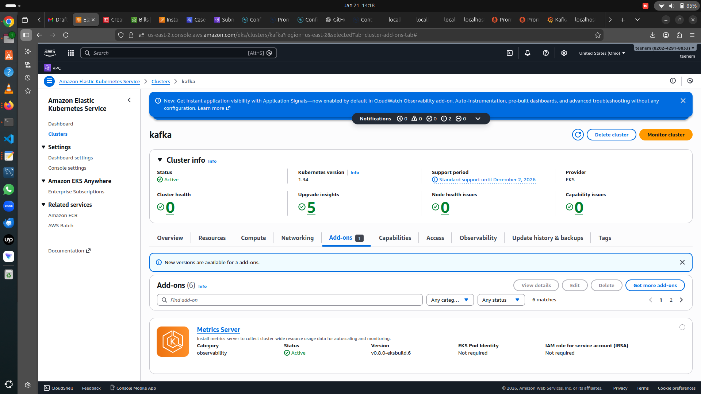

## Prerequisites

Before starting, ensure the following are available:

1. A running **Kubernetes cluster** (EKS or equivalent)

2. `kubectl` installed and configured with cluster access
3. `Helm v3` installed
4. Internet access to pull Helm charts and container images
5. Dynamic storage provisioner enabled (for PersistentVolumes)

---

## 1. Quick Start Using KRaft

### Step 1: Set the tutorial home directory

Set an environment variable pointing to the Confluent KRaft quickstart manifests:

```bash
export TUTORIAL_HOME="https://raw.githubusercontent.com/confluentinc/confluent-kubernetes-examples/master/quickstart-deploy/kraft-quickstart"
````


### Step 2: Create and switch to the Confluent namespace

```bash
kubectl create namespace confluent
kubectl config set-context --current --namespace confluent
```

---

### Step 3: Install Confluent for Kubernetes (CFK)

Add the Confluent Helm repository and install the operator:

```bash
helm repo add confluentinc https://packages.confluent.io/helm
helm repo update

helm upgrade --install confluent-operator confluentinc/confluent-for-kubernetes
```

Verify the operator pod is running:

```bash
kubectl get pods -n confluent
```

---

### Step 4: Install Confluent Platform (KRaft mode)

Deploy the Confluent Platform components (KRaft controller, brokers, and platform services):

```bash
kubectl apply -f $TUTORIAL_HOME/confluent-platform-c3++.yaml
```

Deploy the sample producer application and topic:

```bash
kubectl apply -f $TUTORIAL_HOME/producer-app-data.yaml
```

Wait for all pods to reach `Running` state:

```bash
kubectl get pods -n confluent
```

#### Components Deployed

* KRaft Controller
* Kafka Brokers
* Kafka Connect
* Schema Registry
* ksqlDB
* REST Proxy
* Control Center

---

### Step 5: Access Confluent Control Center

Port-forward the Control Center service:

```bash
kubectl port-forward controlcenter-0 9021:9021 -n confluent
```

Open in your browser:

```
http://localhost:9021
```

Validation checks:

* Confirm the `elastic-0` topic exists
* Verify messages are being produced by the sample producer

---

## 2. Prometheus & Grafana Monitoring Setup

### Step 1: Install kube-prometheus-stack

```bash
helm repo add prometheus-community https://prometheus-community.github.io/helm-charts
helm repo update

helm install monitoring prometheus-community/kube-prometheus-stack \
  -n monitoring \
  --create-namespace
```

---

### Step 2: Verify Prometheus components

```bash
kubectl get statefulsets -n monitoring
kubectl get svc -n monitoring
```

Expected components:

* Prometheus StatefulSet:
  `prometheus-monitoring-kube-prometheus-prometheus`
* Prometheus Service:
  `monitoring-kube-prometheus-prometheus`

⚠️ **Note:**
When using `kubectl port-forward`, avoid local port conflicts. Example:

```bash
kubectl port-forward svc/monitoring-kube-prometheus-prometheus 19090:9090 -n monitoring
```

---

## 3. Kafka Metrics Scraping with Prometheus

### Step 1: Kafka Metrics Exposure

Kafka brokers deployed by CFK expose Prometheus metrics on port:

```
7778
```

---

### Step 2: Kafka ServiceMonitor

Create a file named `kafka-servicemonitor.yaml`:

```yaml
apiVersion: monitoring.coreos.com/v1
kind: ServiceMonitor
metadata:
  name: kafka
  namespace: monitoring
spec:
  selector:
    matchLabels:
      type: kafka
      confluent-platform: "true"
  namespaceSelector:
    matchNames:
      - confluent
  endpoints:
    - port: prometheus
      interval: 30s
```

Apply it:

```bash
kubectl apply -f kafka-servicemonitor.yaml
```

Restart Prometheus to reload targets:

```bash
kubectl rollout restart statefulset \
  prometheus-monitoring-kube-prometheus-prometheus \
  -n monitoring
```

---

### Step 3: Verify Kafka Metrics in Prometheus

Open the Prometheus UI:

```
http://localhost:<port>/targets
```

Validation:

* Kafka targets should appear as **UP**
* Metrics endpoint example:

```
http://<kafka-pod-ip>:7778/metrics
```

---

## 4. Kafka Connect Metrics (Optional / In Progress)

### Objective

Enable monitoring for Kafka Connect using Prometheus.

---

### Attempt 1: Prometheus Metrics Sink Connector

Tried installing the connector inside the Connect container:

```bash
mkdir -p /usr/share/java/kafka-connect-prometheus
curl -LO https://packages.confluent.io/maven/io/confluent/kafka-connect-prometheus-metrics/7.9.0/kafka-connect-prometheus-metrics-7.9.0.jar
```

⚠️ **Result:** Permission denied
➡ Requires a mounted volume or init container for plugin installation.

---

### Attempt 2: Jolokia Metrics Scraping (Successful)

Create `prometheus-kafka-connect-servicemonitor.yaml`:

```yaml
apiVersion: monitoring.coreos.com/v1
kind: ServiceMonitor
metadata:
  name: connect-jolokia
  namespace: monitoring
spec:
  selector:
    matchLabels:
      type: connect
  namespaceSelector:
    matchNames:
      - confluent
  endpoints:
    - port: jolokia
      interval: 30s
```

Apply it:

```bash
kubectl apply -f prometheus-kafka-connect-servicemonitor.yaml
```

✅ Prometheus successfully scrapes Kafka Connect metrics via Jolokia.

---

## 5. Challenges & Lessons Learned

1. Port conflicts are common with `kubectl port-forward`
2. ServiceMonitor selectors must exactly match service labels
3. Kafka metrics labels may differ from standard Grafana dashboards
4. Kafka Connect plugin installation requires init containers or volume mounts
5. CFK and Prometheus resource names may differ across versions — always verify using `kubectl get`

---

## 6. Current Status

| Component             | Status         |
| --------------------- | -------------- |
| EKS Cluster           | ✅ Running      |
| Kafka (CFK + KRaft)   | ✅ Running      |
| Prometheus            | ✅ Running      |
| Grafana               | ✅ Running      |
| Kafka Metrics         | ✅ Scraped      |
| Kafka Connect Metrics | ✅ Scraped      |
| Grafana Dashboards    | ⚠ Needs tuning |

---

## 7. References

* Confluent for Kubernetes
  [https://docs.confluent.io/platform/current/kubernetes/operator/index.html](https://docs.confluent.io/platform/current/kubernetes/operator/index.html)

* kube-prometheus-stack
  [https://github.com/prometheus-community/helm-charts/tree/main/charts/kube-prometheus-stack](https://github.com/prometheus-community/helm-charts/tree/main/charts/kube-prometheus-stack)

* Prometheus ServiceMonitor API
  [https://github.com/prometheus-operator/prometheus-operator/blob/main/Documentation/api.md#servicemonitor](https://github.com/prometheus-operator/prometheus-operator/blob/main/Documentation/api.md#servicemonitor)

* Kafka Prometheus Monitoring
  [https://docs.confluent.io/platform/current/kafka/monitoring.html#prometheus-metrics](https://docs.confluent.io/platform/current/kafka/monitoring.html#prometheus-metrics)

* JMX Exporter
  [https://github.com/prometheus/jmx_exporter](https://github.com/prometheus/jmx_exporter)

```

---

### ✅ Optional (Recommended for GitHub Repo)

**Suggested repo structure:**

```

confluent-kafka-k8s/
├── README.md
├── monitoring/
│   ├── kafka-servicemonitor.yaml
│   └── prometheus-kafka-connect-servicemonitor.yaml

```

If you want, next I can:
- 📊 Draw a **clean architecture + metrics flow diagram**
- 📦 Turn this into a **take-home interview submission**
- 📄 Convert it into a **PDF / Confluence-style doc**

Just say the word.
```
